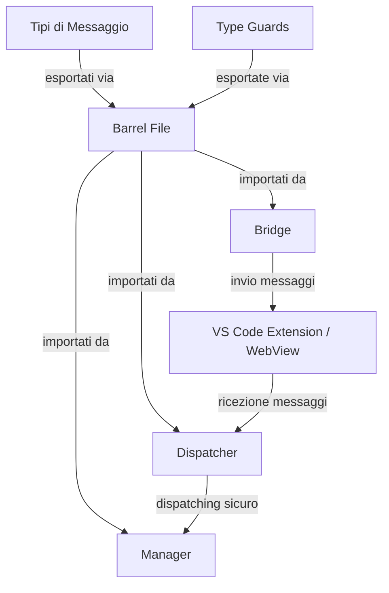

# 🔄 Pattern MAS (Message Architecture System)

> Documentazione di architettura per il sistema di messaggi di Jarvis-IDE

## Introduzione

Il Pattern MAS (Message Architecture System) è un'architettura specializzata per la gestione sicura dei messaggi in sistemi distribuiti con TypeScript. Implementa un approccio basato su type-safety, centralizzazione dei tipi, e guardie di tipo per garantire comunicazione robusta tra componenti.

## 🏗️ Struttura



## 🔑 Componenti Chiave

### 1. Definizione Tipi (Union Type)

Tutti i messaggi sono definiti come discriminated union con campo `type` come discriminante:

```typescript
// src/shared/types/websocketMessageUnion.ts
export type WebSocketMessageUnion =
  | { type: 'ws.ping'; payload: { timestamp: number } }
  | { type: 'ws.pong'; payload: { timestamp: number } }
  | { type: 'ws.error'; payload: { error: string; code: number } };
```

### 2. Type Guards

Per ogni tipo di messaggio esiste una guardia dedicata:

```typescript
// src/shared/types/websocket-guards.ts
export function isPingMessage(message: unknown): message is PingMessage {
  return (
    isWebSocketMessage(message) &&
    message.type === 'ws.ping' &&
    typeof message.payload === 'object' &&
    message.payload !== null &&
    'timestamp' in message.payload &&
    typeof message.payload.timestamp === 'number'
  );
}
```

### 3. Barrel File Centralizzato

Tutte le esportazioni sono centralizzate in un barrel file:

```typescript
// src/shared/messages/index.ts
// Import delle definizioni di tipo
import { type WebSocketMessageUnion } from '../types/websocketMessageUnion';
import { type WebviewMessageUnion } from '../types/webview-message';
import { type AgentMessageUnion } from '../types/mas-message';

// Import delle guardie
import {
  isWebSocketMessage,
  isPingMessage,
  // ...
} from '../types/websocket-guards';

// Export centralizzato
export type { 
  WebSocketMessageUnion,
  WebviewMessageUnion,
  AgentMessageUnion
};

export {
  isWebSocketMessage,
  isPingMessage,
  // ...
};
```

### 4. Bridge per Invio Messaggi

I bridge inviano messaggi e implementano la validazione:

```typescript
// webview-ui/src/utils/WebSocketBridge.ts
import {
  type SupportedMessageUnion,
  isWebviewMessageUnknown
} from '@shared/messages';

public sendMessage(message: SupportedMessageUnion): void {
  try {
    if (!isWebviewMessageUnknown(message)) {
      this.logger.warn('Tentativo di inviare un messaggio non valido:', { message });
      return;
    }
    
    vscode.postMessage(message);
  } catch (error) {
    this.logger.error('Errore nell\'invio del messaggio:', { error, message });
  }
}
```

### 5. Dispatcher per Gestione Messaggi

I dispatcher utilizzano le guardie per il routing sicuro:

```typescript
// webview-ui/src/utils/WebviewDispatcher.ts
import {
  type WebSocketMessageUnion,
  type AgentMessageUnion,
  isWebSocketMessage,
  isAgentMessage,
  // ...
} from '@shared/messages';

export function handleWebviewDispatch(message: unknown): void {
  try {
    if (!message) {
      componentLogger.warn('Ricevuto messaggio nullo o undefined');
      return;
    }
    
    if (isWebSocketMessage(message)) {
      handleWebSocketMessage(message);
    } else if (isAgentMessage(message)) {
      handleAgentMessage(message);
    } else if (isExtensionPromptMessage(message)) {
      handleExtensionPromptMessage(message);
    } else {
      componentLogger.warn('Messaggio ricevuto non valido:', { message });
    }
  } catch (error) {
    componentLogger.error('Errore nel dispatching del messaggio:', { error });
  }
}
```

### Provider-Specific MAS Implementations

#### Anthropic Message Architecture

L'AnthropicHandler implementa il pattern MAS per garantire una comunicazione type-safe e manutenibile con l'API Claude.

##### Message Types

```typescript
// Definizione dei tipi di messaggio
type AnthropicMessage = {
  role: 'user' | 'assistant';
  content: string;
  name?: string;
};

type AnthropicResponse = {
  completion: string;
  stop_reason: string;
  model: string;
  usage: TokenUsage;
};
```

##### Message Flow

1. **Input Mapping**:
   - Conversione da formato interno a formato Anthropic
   - Validazione tipi e contenuti
   - Gestione metadati

2. **Response Handling**:
   - Parsing risposte Claude
   - Mappatura token usage
   - Gestione streaming chunks

3. **Error Management**:
   - Type-safe error handling
   - Fallback mechanisms
   - Logging strutturato

##### Integration Points

- **Bridge Layer**: Connessione con il sistema di messaggi core
- **Event System**: Gestione eventi asincroni
- **State Management**: Tracking dello stato della conversazione

##### Testing Strategy

L'implementazione MAS nell'AnthropicHandler è validata attraverso:

1. **Unit Tests**:
   - Verifica mappatura messaggi
   - Test type safety
   - Validazione flow

2. **Integration Tests**:
   - Test end-to-end flow
   - Verifica bridge layer
   - Validazione eventi

3. **Type Checks**:
   - Controllo type inference
   - Validazione union types
   - Test narrowing

## 🛡️ Vantaggi del Pattern MAS

### Type Safety

- **Compile-time Safety**: Rilevamento errori in fase di compilazione
- **Runtime Safety**: Validazione messaggi a runtime tramite guardie
- **Type Narrowing**: Accesso sicuro ai campi dopo validazione
- **IDE Support**: Autocomplete e suggerimenti intelligenti

### Manutenibilità

- **Centralizzazione**: Tipi e guardie in un unico punto
- **Coerenza**: Importazioni standardizzate e structure uniforme
- **Modularità**: Separazione chiara tra definizione e utilizzo
- **Isolamento**: Cambiamenti di struttura isolati nei tipi di base

### Diagnostica

- **Tracciabilità**: Log strutturati per tipo di messaggio
- **Osservabilità**: Visibilità nel flusso di comunicazione
- **Error Handling**: Gestione coerente degli errori
- **Testabilità**: Test unitari facilitati per ogni componente

## 📊 Linee Guida Implementative

### Regole Import/Export

```typescript
// ✅ CORRETTO: Importare dal barrel file
import { 
  type WebSocketMessageUnion, 
  isPingMessage 
} from '@shared/messages';

// ❌ ERRATO: Importare direttamente dai file singoli
import { WebSocketMessageUnion } from '../types/websocketMessageUnion';
import { isPingMessage } from '../types/websocket-guards';
```

### Regole di Accesso ai Payload

```typescript
// ✅ CORRETTO: Accesso al payload dopo guardia
if (isPingMessage(message)) {
  const timestamp = message.payload.timestamp;
  // TypeScript sa che timestamp è un number
}

// ❌ ERRATO: Accesso diretto senza controllo
const timestamp = message.payload.timestamp;
// Potenziale errore runtime
```

### Regole di Dispatching

```typescript
// ✅ CORRETTO: Dispatching con narrowing di tipo
if (isWebSocketMessage(message)) {
  handleWebSocketMessage(message);
  // TypeScript sa che message è WebSocketMessageUnion
}

// ❌ ERRATO: Dispatching con cast di tipo
if (message.type.startsWith('ws.')) {
  handleWebSocketMessage(message as WebSocketMessageUnion);
  // Cast insicuro
}
```

## 🧪 Testing del Pattern MAS

### Unit Test

I test unitari verificano l'integrità delle guardie e dei dispatcher:

```typescript
// WebviewDispatcher.spec.ts
it('dovrebbe chiamare l\'handler registrato per un tipo di messaggio', () => {
  // Crea un mock handler
  const mockHandler = vi.fn();
  
  // Registra l'handler
  registerWebSocketMessageHandler('ws.test', mockHandler);
  
  // Crea un messaggio di test
  const testMessage = {
    type: 'ws.test',
    payload: { testData: 'test' }
  };
  
  // Gestisci il messaggio
  handleWebSocketMessage(testMessage);
  
  // Verifica che l'handler sia stato chiamato con il messaggio
  expect(mockHandler).toHaveBeenCalledWith(testMessage);
});
```

### Integration Test

I test di integrazione verificano l'interazione tra componenti:

```typescript
// Test di integrazione (esempio)
it('dovrebbe propagare correttamente i messaggi dal bridge al dispatcher', () => {
  // Setup dei mock per il dispatcher
  const dispatchSpy = vi.spyOn(dispatcher, 'handleWebviewDispatch');
  
  // Simula arrivo messaggio dal bridge
  window.dispatchEvent(new MessageEvent('message', {
    data: {
      type: 'ws.ping',
      payload: { timestamp: Date.now() }
    }
  }));
  
  // Verifica che il dispatcher abbia ricevuto il messaggio
  expect(dispatchSpy).toHaveBeenCalled();
});
```

## 🌉 Migrazione e Retrocompatibilità

Per migrazione progressiva di moduli legacy:

1. **Wrapper di Compatibilità**: Adattatori per vecchi formati
2. **Dual Export**: Supporto temporaneo per vecchie e nuove import
3. **Deprecation Warning**: Marcatura di API vecchie come deprecate
4. **Versioning**: Versioni chiare nei commenti di file

## 📘 Conclusioni

Il pattern MAS fornisce un'architettura robusta, type-safe e manutenibile per la gestione dei messaggi in Jarvis-IDE. La centralizzazione delle definizioni, l'uso coerente di guardie di tipo e la chiara separazione delle responsabilità garantisce comunicazione affidabile tra i componenti del sistema.

---

Documento redatto da: 🧠 Sviluppatore AI 1  
Versione: 1.0.0  
Data: 15 Agosto 2023 