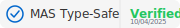

# Badge del Progetto Jarvis-IDE

Questa directory contiene i badge SVG utilizzabili nella documentazione del progetto.

## Badge disponibili

### MAS Type-Safe Verified

Badge che certifica che i componenti MAS seguono il pattern Union Dispatcher Type-Safe.

#### Modalità scura (per sfondi chiari)


```markdown

```

#### Modalità chiara (per sfondi scuri)


```markdown

```

### MAS Component Pending

Badge che indica che un componente MAS è in attesa di refactoring.


```markdown

```

### MAS Component In Review

Badge che indica che un componente MAS è in fase di revisione.


```markdown

```

## Come utilizzare i badge

Puoi includere questi badge in:

1. **File README.md** del progetto
2. **Documentazione tecnica**
3. **Pull Request** (per indicare la conformità a standard)
4. **Wiki** del progetto
5. **Issue tracker** (per indicare lo stato dei componenti)

## Stato del componente: ciclo di vita del badge

I componenti MAS attraversano diverse fasi nel loro ciclo di vita:

1. **Pending** - Il componente è in attesa di refactoring
2. **In Review** - Il componente è stato refactorizzato ed è in fase di revisione
3. **Verified** - Il componente è stato verificato e approvato

## Creazione di nuovi badge

Per mantenere uno stile coerente, i nuovi badge dovrebbero:

- Avere dimensioni `180x28px`
- Utilizzare lo stesso font-family
- Seguire gli stessi colori dei badge esistenti
- Includere una data di validazione quando appropriato 